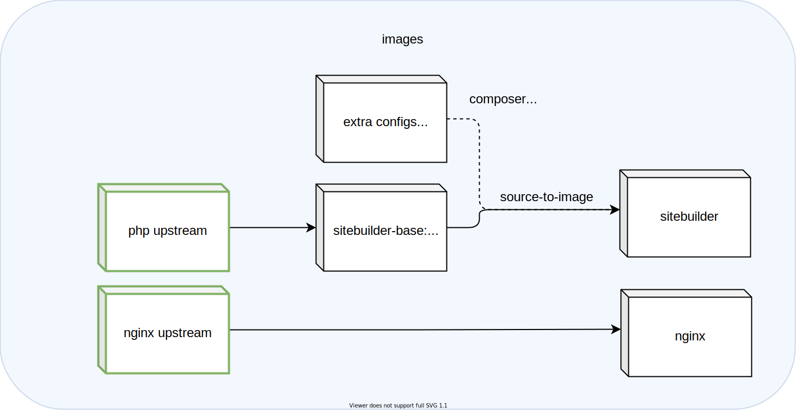

# drupalSite-operator

Kubernetes operator that controls the main API of the Drupal service: the DrupalSite CRD.

For an introduction to the Operator pattern and how we use it, take a look at our presentation at Kubecon EU 2021!

## [Building a Kubernetes infrastructure for CERN's Content Management Systems](https://zenodo.org/record/4730874)

This [paper](https://zenodo.org/record/4730874) describes the use case served with the `drupalsite-operator`.
Flip through it to get some context!

## Drupal service architecture

The Drupal service is designed around the concept of the DrupalSite.
The deployment looks like this:




The [architecture description](docs/README.md) explains in more detail.

## CRDs

### [DrupalSite](config/samples/)

A `DrupalSite` defines all the necessary info for the operator to instantiate a Drupal website, integrated with the CERN environment.
Example:

```yaml
apiVersion: drupal.webservices.cern.ch/v1alpha1
kind: DrupalSite
metadata:
  name: drupalsite-sample
spec:
  # URL to request in the route.
	# Recommended to set `<environmentName>-<projectname>.web.cern.ch`
  # or `<projectname>.web.cern.ch` if this is the "live" site
  siteUrl: mysite.web.cern.ch
  # Generates the image tags. Changing this triggers the upgrade workflow.
  version:
    name: "v8.9-1"
    releaseSpec: "RELEASE-2021.05.31T09-39-10Z"
  configuration:
    # Name of the DrupalSite (in the same namespace) to clone from, typically the "live"/production website
    cloneFrom: "<myproductionsite>"
    # "standard", "critical" or "test"
    qosClass: "standard"
    databaseClass: "standard"
    diskSize: "5Gi"
```
## Resources

In order to iteratively develop the operator, we must take into account the following concepts:

- The controller manager.
- The bundle: a representation of the operator in the form of manifests. A bundle consists of a `ClusterServiceVersion` (CSV), `CustomResourceDefinitions` (CRDs), manifests not part of the CSV but required by the operator, some metadata (annotations.yaml), the necessary service account and RBAC for the controller manager to run, and a `bundle.Dockerfile`
- The catalog index: the catalog index will be composed of the different bundles (versions) of the operator we want to deploy in our dev/prod clusters.
- The `CatalogSource`, `Subscription` and `OperatorGroup` OpenShift resources for this specific operator, that will allow the operator to be deployed according to the CSV configuration.

## Development

Below you will find the tools needed for development purposes.

### Requirements

In order to iteratively build and debug new changes, setup the the following. This also assumes you have docker up and running in your local machine:

```bash
# Assuming your operator repository is under /home/dimitra/git/gitlab.cern.ch/drupal/paas/drupalsite-operator
docker run -it --network host --rm -v "/home/dimitra/git/gitlab.cern.ch/drupal/paas/drupalsite-operator:/drupalsite-operator" -v /var/run/docker.sock:/var/run/docker.sock -w /drupalsite-operator docker:19.03.1

apk add make curl gnupg go gcc bash musl-dev openssl-dev git libc-dev build-base
# Add glibc, requisite for opm
wget -q -O /etc/apk/keys/sgerrand.rsa.pub https://alpine-pkgs.sgerrand.com/sgerrand.rsa.pub
wget https://github.com/sgerrand/alpine-pkg-glibc/releases/download/2.33-r0/glibc-2.33-r0.apk
apk add glibc-2.33-r0.apk

export OPERATOR_SDK_VERSION=1.9.0
export GOLANG_VERSION=1.15.12
export ARCH=$(case $(uname -m) in x86_64) echo -n amd64 ;; aarch64) echo -n arm64 ;; *) echo -n $(uname -m) ;; esac)
export OS=$(uname | awk '{print tolower($0)}')
export OPERATOR_SDK_DL_URL=https://github.com/operator-framework/operator-sdk/releases/download/v${OPERATOR_SDK_VERSION}
curl -LO ${OPERATOR_SDK_DL_URL}/operator-sdk_${OS}_${ARCH}
gpg --keyserver keyserver.ubuntu.com --recv-keys 052996E2A20B5C7E
curl -LO ${OPERATOR_SDK_DL_URL}/checksums.txt
curl -LO ${OPERATOR_SDK_DL_URL}/checksums.txt.asc
gpg -u "Operator SDK (release) <cncf-operator-sdk@cncf.io>" --verify checksums.txt.asc
grep operator-sdk_${OS}_${ARCH} checksums.txt | sha256sum -c -
chmod +x operator-sdk_${OS}_${ARCH} && mv operator-sdk_${OS}_${ARCH} /usr/local/bin/operator-sdk
wget https://dl.google.com/go/go${GOLANG_VERSION}.src.tar.gz
tar -xzf go${GOLANG_VERSION}.src.tar.gz -C /usr/local 
cd /usr/local/go/src
./make.bash
export PATH=$PATH:/usr/local/go/bin
apk del go
cd /drupalsite-operator
```

### Develop a new version

Let's assume you want to deploy version `0.0.X`.

First, you'll deploy the new version in a `dev` cluster. The new bundle will be be added to the corresponding catalog pointing to `catalog:$CI_COMMIT_REF_NAME`.

For this change, we'll need to upate:
- `VERSION` variable in `.gitlab-ci.yaml` file.

With the previous tool, let's generate the new bundle:
```bash
export VERSION=0.0.X
export CI_COMMIT_REF_NAME=<BRANCH_NAME>
export IMAGE_TAG_BASE="registry.cern.ch/drupal/paas/drupalsite-operator"
export IMG="${IMAGE_TAG_BASE}-controller:${VERSION}"
export CATALOG_IMG=${IMAGE_TAG_BASE}-catalog:${CI_COMMIT_REF_NAME}
export BUNDLE_IMG=${IMAGE_TAG_BASE}-bundle:v${VERSION}
export BUNDLE_CHANNELS="--channels='stable'"
export BUNDLE_DEFAULT_CHANNEL="--default-channel='stable'"
export BUNDLE_METADATA_OPTS="${BUNDLE_CHANNELS} ${BUNDLE_DEFAULT_CHANNEL}"
export BUNDLE_IMGS=${BUNDLE_IMG}

# Login into registry.cern.ch
# Copy the value of the secret from GITLAB CI/CD Variables https://gitlab.cern.ch/drupal/paas/drupalsite-operator/-/settings/ci_cd
export DOCKER_AUTH_CONFIG="{\"auths\":{\"registry.cern.ch\":{\"auth\":\"xxx\"}}}"
mkdir -p ~/.docker/ && echo "${DOCKER_AUTH_CONFIG}" > ~/.docker/config.json

# Generate controller image and push it.
make docker-build docker-push
# Generate, build and push the bundle manifests.
make bundle bundle-build bundle-push

# Or altogether
make docker-build docker-push bundle bundle-build bundle-push
```

At this point, you will be able to test our bundle in a dev cluster. 

Note that **is not recommended** to perform any change under the generated bundle folder. Everything is auto-generated from the `config/` folder.

To test the bundle in a dev cluster:
```bash
# Login into your dev cluster
# export KUBECONFIG=...

# Run the bundle on an OKD4 cluster.
operator-sdk run bundle registry.cern.ch/drupal/paas/drupalsite-operator-bundle:v${VERSION} -n openshift-cern-drupalsite-operator
# sample output
# INFO[0030] Successfully created registry pod: registry-cern-ch-drupal-paas-drupalsite-operator-bundle-v0-0-1
# INFO[0030] Created CatalogSource:drupalsite-operator-catalog
# INFO[0031] Created Subscription: drupalsite-operator-v0-0-1-sub
# INFO[0033] Approved InstallPlan install-vkgqz for the Subscription: drupalsite-operator-v0-0-1-sub
# INFO[0033] Waiting for ClusterServiceVersion "openshift-cern-drupalsite-operator/drupalsite-operator.v0.0.1" to reach 'Succeeded' phase
# INFO[0033]   Waiting for ClusterServiceVersion "openshift-cern-drupalsite-operator/drupalsite-operator.v0.0.1" to appear
# INFO[0044]   Found ClusterServiceVersion "openshift-cern-drupalsite-operator/drupalsite-operator.v0.0.1" phase: Pending
# INFO[0048]   Found ClusterServiceVersion "openshift-cern-drupalsite-operator/drupalsite-operator.v0.0.1" phase: InstallReady
# INFO[0049]   Found ClusterServiceVersion "openshift-cern-drupalsite-operator/drupalsite-operator.v0.0.1" phase: Installing
# INFO[0060]   Found ClusterServiceVersion "openshift-cern-drupalsite-operator/drupalsite-operator.v0.0.1" phase: Succeeded
# INFO[0060] OLM has successfully installed "drupalsite-operator.v0.0.1"
```

To clean up our tests, consider:
```bash
# Login into the dev cluster
# export KUBECONFIG=...

cd drupalsite-operator/

operator-sdk cleanup drupalsite-operator --delete-all -n openshift-cern-drupalsite-operator

# In case you are manually adding CatalogSource, Subscription, etc.
oc delete CatalogSource/drupalsite-operator -n openshift-cern-drupalsite-operator
oc delete OperatorGroup/drupalsite-operator -n openshift-cern-drupalsite-operator
oc delete Subscription/drupalsite-operator -n openshift-cern-drupalsite-operator
oc get csv -A
oc delete csv/drupalsite-operator.v0.0.<X> -n openshift-cern-drupalsite-operator

# To delete the CRD
kustomize build config/crd | kubectl delete -f -
```

If you are happy with your results, next steps are:

- Before commit the changes, do not forget to update the `.gitlab-ci.yaml` from:
  ```yaml
  variables:
    VERSION: 0.0.1
    ...
  ```

  to:
  ```yaml
  variables:
    VERSION: 0.0.X
    ...
  ```
- Commit the changes and let the CI do the work, i.e., to build and push both the bundle and the catalog, this last containing the bundle we have generated.

Once pushed, the CI will trigger the build of the bundle according to the variables we pass under `.gitlab-ci.yaml`, and after building, it will build and push the catalog with the new version to `catalog:$CI_COMMIT_REF_NAME`.

### Simulate catalog provision in a dev cluster

If you want to simulate how the new version will behave once we deployed, you can upgrade your dev cluster using the `catalog:$CI_COMMIT_REF_NAME` image.

Fisrt, you need to update the value `catalogSource.spec.image` in [values-dev-drupal.yaml](https://gitlab.cern.ch/paas-tools/okd4-install/-/blob/master/chart/values-dev-drupal.yaml) file:

```yaml
operators-catalogue:
  operatorSources:
    # CERN App Catalogue - Drupalsite Operator
    drupalsite-operator:
      catalogSource:
        spec:
          sourceType: grpc
          displayName: "DrupalSite Operator"
          image: registry.cern.ch/drupal/paas/drupalsite-operator-catalog:upgrade-operator-sdk-v1.9
          publisher: "CERN Web Frameworks"
          updateStrategy:
            registryPoll:
              interval: "30m"
      subscription:
        spec:
          channel: "stable"
          installPlanApproval: "Automatic"
          name: drupalsite-operator
          # source corresponds to the generated catalog source name
          # this catalog source name is autogenerated based on the operatorSources.<nameOperator> element.
          # e.g., for operatorSources.drupalsite-operator, catalog name will be drupalsite-operator
          source: drupalsite-operator
          sourceNamespace: openshift-cern-drupalsite-operator
      operatorGroup:
        # deploy to all namespaces by default
        spec: {}
```

Then, you can upgrade your cluster following [Updating cluster configuration](https://okd-internal.docs.cern.ch/development/#updating-cluster-configuration) docs.

Run integration tests for drupal on you dev cluster to validate your changes:
```bash
export CI_JOB_ID=${RANDOM}
XTERM=term bats -trp tests/4-drupal/
```

If you want to try more changes, you need to clean up erverything and re-rerun it again:
```bash
operator-sdk cleanup drupalsite-operator --delete-all -n openshift-cern-drupalsite-operator
```

You can also push your dev catalog image in order to test your changes before commiting:
```
# This should be run inside the same container you used to build/push the bundle before
make catalog-build catalog-push
```

### Release a new version workflow

1. Follow [Develop a new version](#develop-a-new-version) steps
2. Follow [Simulate catalog provision in a dev cluster](#simulate-catalog-provision-in-a-dev-cluster) steps
3. Open a `MR` in [okd4-install](https://gitlab.cern.ch/paas-tools/okd4-install/):
    - Update the value `catalogSource.spec.image` in [values-dev-drupal.yaml](https://gitlab.cern.ch/paas-tools/okd4-install/-/blob/master/chart/values-dev-drupal.yaml) file using as a tag the name of your dev branch in `drupalsite-operator`.
    - Trigger `Integration tests` job.
4. When `Integration tests` are green, the `MR` in `drupalsite-operator` can be merged.
5. Create a [tag](https://gitlab.cern.ch/drupal/paas/drupalsite-operator/-/tags/new) for the new version from master branch. For consistency, use as a tag name the version that you are going to release, i.e. if you release version `0.0.1`, the name of the tag should be `0.0.1`.
6. In your `MR` in okd4-install, update the tag of `catalogSource.spec.image` in `values-dev-drupal.yaml`, `values-drupal-stg.yaml` and `values-drupal.yaml` with the new version and merge.

## Configmaps for each QoS class

The operator configures each website according to its QoS class with configmaps.
It reads the configmaps from `/tmp/runtime-config`.
In order to test locally, we must first copy them:

```bash
	cp -r config/qos-critical /tmp/runtime-config/
	cp -r config/qos-eco /tmp/runtime-config/
	cp -r config/qos-standard /tmp/runtime-config/
	cp -r config/sitebuilder /tmp/runtime-config/
```

## Testing

This project uses [envtest](https://pkg.go.dev/sigs.k8s.io/controller-runtime/pkg/envtest) for basic integration tests by running a local control plane. The control plane spun up by `envtest`, doesn't have any K8s controllers except for the controller it is testing. The tests for the drupalsite controller are located in [controllers/drupalsite_controller_test.go](controllers/drupalsite_controller_test.go).

To run these tests locally, use `make test`
## Developed with [operator-sdk](https://sdk.operatorframework.io/)

This project was generated with the [operator-sdk](https://sdk.operatorframework.io/)
and has been updated to `operator-sdk-v1.9`.

For reference:
- Working with bundle images: https://docs.okd.io/latest/operators/operator_sdk/osdk-working-bundle-images.html
- Operator Framework packaging formats: https://access.redhat.com/documentation/en-us/openshift_container_platform/4.7/html-single/operators/index#olm-packaging-format
- OLM: https://access.redhat.com/documentation/en-us/openshift_container_platform/4.7/html-single/operators/index#operator-lifecycle-manager-olm
- CSV and API Markers: https://v0-18-x.sdk.operatorframework.io/docs/golang/references/markers/
- WordPress Operator: https://gitlab.cern.ch/wordpress/wordpress-operator
