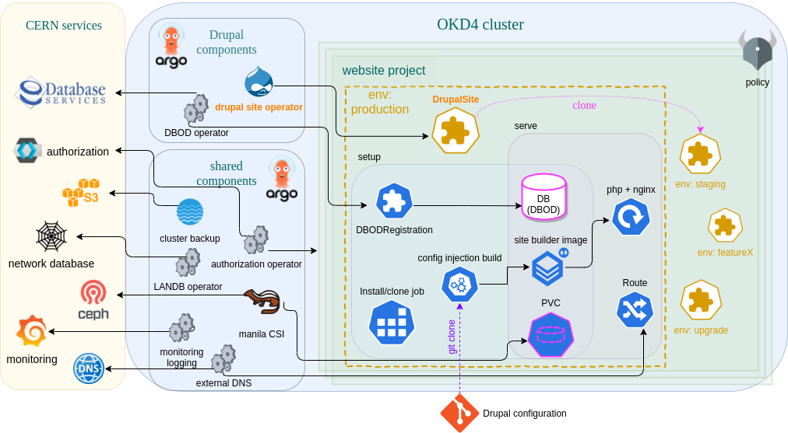

# drupalSite-operator

Kubernetes operator that controls the main API of the Drupal service: the DrupalSite CRD.

For an introduction to the Operator pattern and how we use it, take a look at our presentation at Kubecon EU 2021!

### [Building a Kubernetes infrastructure for CERN's Content Management Systems](https://zenodo.org/record/4730874)

This [paper](https://zenodo.org/record/4730874) describes the use case served with the `drupalsite-operator`.
Flip through it to get some context!

### Drupal service architecture

The Drupal service is designed around the concept of the DrupalSite.
The deployment looks like this:




The [architecture description](docs/README.md) explains in more detail.

## CRDs

### [DrupalSite](config/samples/)

A `DrupalSite` defines all the necessary info for the operator to instantiate a Drupal website, integrated with the CERN environment.
Example:

```yaml
apiVersion: drupal.webservices.cern.ch/v1alpha1
kind: DrupalSite
metadata:
  name: drupalsite-sample
spec:
  # Create an ingress route?
  publish: true
  # Is this the main/production site of the project? (all other sites in the same project considered extra environments for dev/test
  mainSite: true
  # URL to request in the route.
	# Recommended to set `<environmentName>-<projectname>.web.cern.ch`
  # or `<projectname>.web.cern.ch` if this is the "live" site
  siteUrl: mysite.web.cern.ch
  # Generates the image tags. Changing this triggers the upgrade workflow.
  version:
    name: "v8.9-1"
    releaseSpec: "RELEASE-2021.05.31T09-39-10Z"
  configuration:
    # Name of the DrupalSite (in the same namespace) to clone from. Defaults to the main/production website.
    cloneFrom: "<myproductionsite>"
    qosClass: "standard"
    databaseClass: "standard"
    diskSize: "5Gi"
```

## Running the operator

### Deployment

The operator is packaged with a [helm chart](chart/drupalsite-operator).
However, we **deploy [CRDs](config/crd/bases) separately**. Both must be deployed for the operator to function.
In our infrastructure, we deploy the operator and its CRD with 2 separate ArgoCD Applications.

### Configuration

When deploying the Helm chart, operator configuration is exposed as Helm values.
This reference is useful to run the operator locally.

#### cmdline arguments

argument | example | description
--- | --- | ---
`sitebuilder-image` | gitlab-registry.cern.ch/drupal/paas/cern-drupal-distribution/site-builder | The sitebuilder source image name
`nginx-image` | gitlab-registry.cern.ch/drupal/paas/cern-drupal-distribution/nginx | The nginx source image name

#### Configmaps for each QoS class

The operator configures each website according to its QoS class with configmaps.
It reads the configmaps from `/tmp/runtime-config`.
In order to test locally, we must first copy them:

```bash
$ cp -r chart/drupalsite-operator/runtime-config/ /tmp/
```

#### Testing
This project uses [envtest](https://pkg.go.dev/sigs.k8s.io/controller-runtime/pkg/envtest) for basic integration tests by running a local control plane. The control plane spun up by `envtest`, doesn't have any K8s controllers except for the controller it is testing. The tests for the drupalsite controller are located in [controllers/drupalsite_controller_test.go](controllers/drupalsite_controller_test.go).

To run these tests locally, use `make test`
## Developed with [operator-sdk](https://sdk.operatorframework.io/)

This project was generated with the [operator-sdk](https://sdk.operatorframework.io/)
and has been updated to `operator-sdk-v1.3`.
