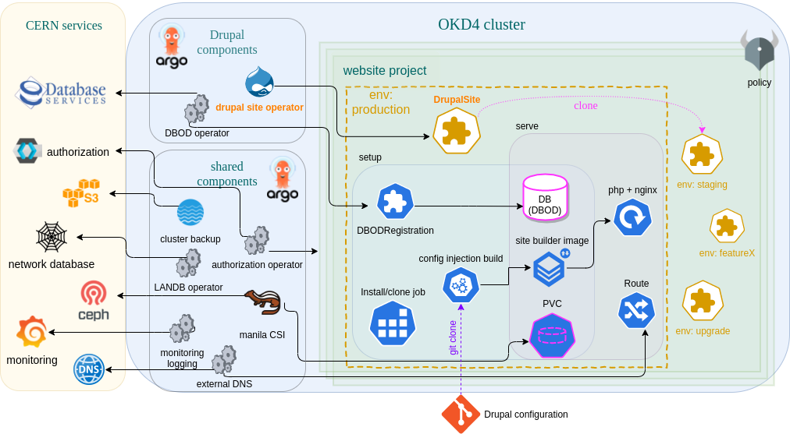

# Drupal

Deploys the OKD4 configuration specific to the Drupal use case.

## Architecture

The Drupal component provides APIs to define Drupal sites:
- DrupalSite
- DBODRegistration
- DatabaseClass

and consists of 2 operators:
- [drupalSite operator](https://gitlab.cern.ch/drupal/paas/drupalsite-operator)
- [DBOD operator](https://gitlab.cern.ch/drupal/paas/dbod-operator/)

[New projects](https://gitlab.cern.ch/drupal/paas/drupal-custom-okd-project-template)
on clusters with this component enabled come with an `ApplicationRegistration` and limited RBAC permissions
for the "SaaS" role.

The DrupalSite CRD is the entrypoint and automates the provisioning of a Drupal site with database and persistent storage,
a server deployment, and a customized Drupal distribution.
The DB lives on DBOD.

Databases are provisioned with the DBOD operator on an administrator-defined pool of premade DBOD instances,
split into `DatabaseClasses` that define QoS.

Drupal distributions are defined for each website by injecting extra composer dependencies (Drupal modules)
on top of a standard [CERN Drupal distribution](https://gitlab.cern.ch/drupal/paas/cern-drupal-distribution),
using the [composer merge plugin](https://github.com/wikimedia/composer-merge-plugin) (replacing existing modules is disabled).
The extra configuration is picked from a gitlab repo provided by the user: `DrupalSite.configuration.extraConfigsRepo`.
A source-to-image build then creates the final "sitebuilder" image.

DrupalSites have an associated environment, a concept similar to git branches.
The default environment is "production".
Additional DrupalSites can be created with different environments for feature development or testing.
Each environment is isolated, with its own DB and persistent storage.
Policy prohibits multiple "production" environments in the same project.

### User roles

The design considers 2 roles for website admins: "SaaS" and "PaaS".

The first defined user role "SaaS" considers a limited responsibility model for website admins that want to benefit
from a high level of support.
It only allows the creation of `DrupalSite` resources,
where policy constraints prevent image overrides.
The goal is for the Infrastructure to maintain control over the base Drupal environment.

A "PaaS" role with full PaaS privileges is envisioned for website admins that want to take full control of their deployment
and benefit only from PaaS level support.
