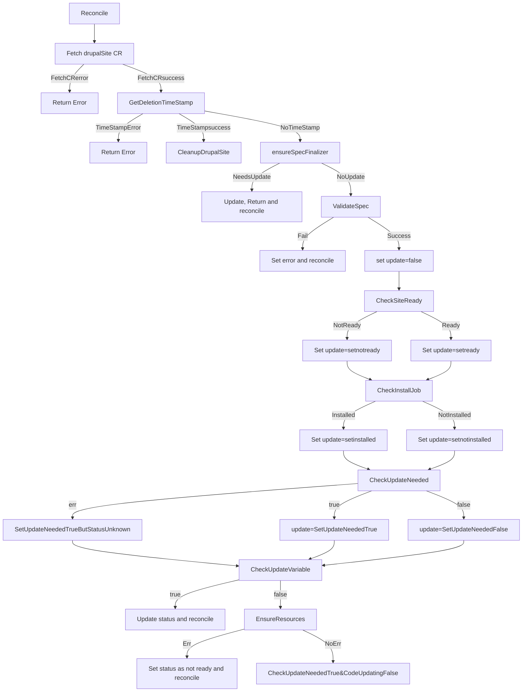

## Reconcilation

```mermaid
graph TD;
    Reconcile-->FetchCR["Fetch drupalSite CR"];
    FetchCR--FetchCRerror-->ReturnError1["Return Error"];
    FetchCR--FetchCRsuccess-->GetDeletionTimeStamp;
    GetDeletionTimeStamp--TimeStampError-->ReturnError2["Return Error"];
    GetDeletionTimeStamp--TimeStampsuccess-->CleanupDrupalSite;
    GetDeletionTimeStamp--NoTimeStamp-->ensureSpecFinalizer;
    ensureSpecFinalizer--NeedsUpdate-->Return&Reconcile["Update, Return and reconcile"];
    ensureSpecFinalizer--NoUpdate-->ValidateSpec;
    ValidateSpec--Fail-->Return&Reconcile1["Set error and reconcile"];
    ValidateSpec--Success-->Update["set update=false"];
    Update-->CheckSiteReady;
    CheckSiteReady--NotReady-->SetNotReady["Set update=setnotready"];
    CheckSiteReady--Ready-->SetReady["Set update=setready"];
    SetNotReady-->CheckInstallJob;
    SetReady-->CheckInstallJob;
    CheckInstallJob--Installed-->SetInstalled["Set update=setinstalled"];
    CheckInstallJob--NotInstalled-->SetNotInstalled["Set update=setnotinstalled"];
    SetInstalled-->CheckUpdateNeeded;
    SetNotInstalled-->CheckUpdateNeeded;
    CheckUpdateNeeded--err-->SetUpdateNeededTrueButStatusUnknown;
    CheckUpdateNeeded--true-->SetUpdateNeededTrue["update=SetUpdateNeededTrue"];
    CheckUpdateNeeded--false-->SetUpdateNeededFalse["update=SetUpdateNeededFalse"];
    SetUpdateNeededTrueButStatusUnknown-->CheckUpdateVariable;
    SetUpdateNeededTrue-->CheckUpdateVariable;
    SetUpdateNeededFalse-->CheckUpdateVariable;
    CheckUpdateVariable--true-->Return&Reconcile2["Update status and reconcile"];
    CheckUpdateVariable--false-->EnsureResources;
    EnsureResources--Err-->SetNotReadyReconcile["Set status as not ready and reconcile"];
    EnsureResources--NoErr-->CheckUpdateNeededTrue&CodeUpdatingFalse;

```
